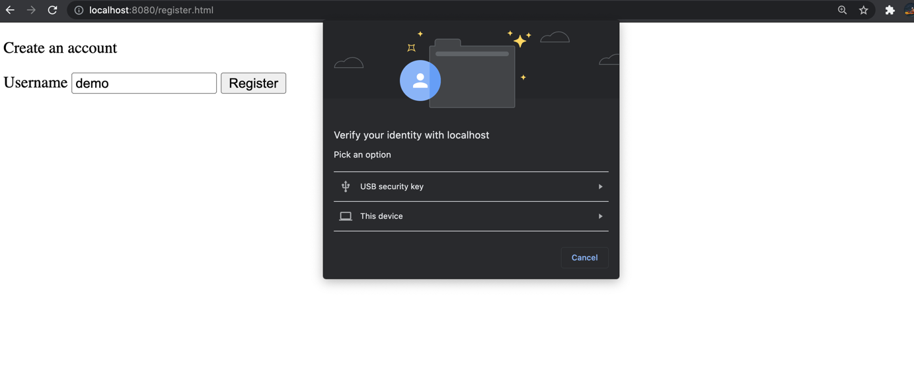
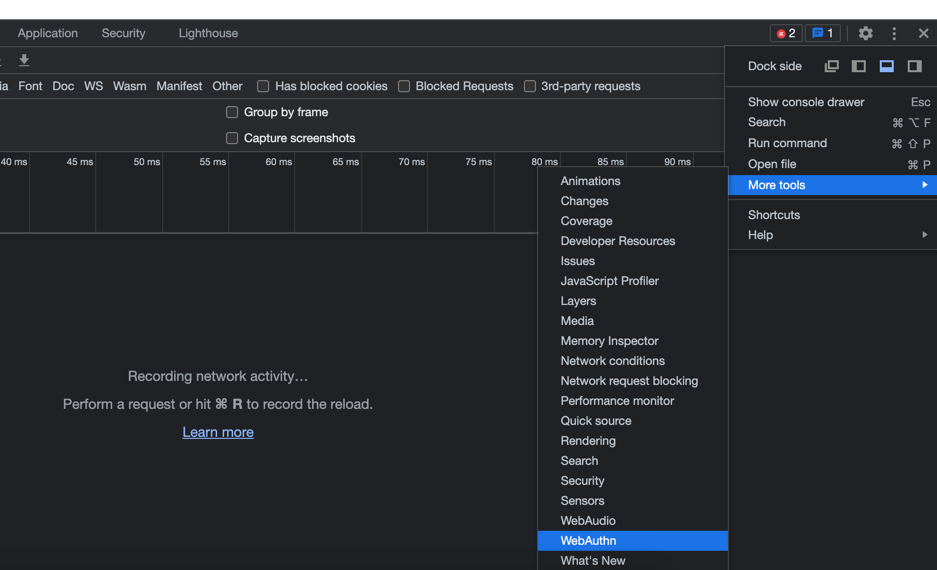
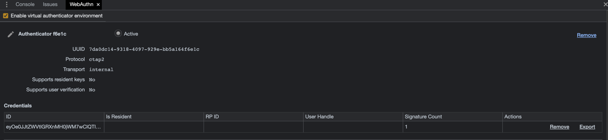

# webauthn-spring-boot-starter demo

Given a typical spring boot application that uses the form login authentication method,
we are migrating existing users to public key based credentials using *webauthn-spring-boot-starter*.

More details are explained [here](https://mihaita-tinta.medium.com/how-to-add-passwordless-authentication-in-java-with-spring-boot-72278a56a942)

To run locally just execute:
`mvn install`
and then
`mvn spring-boot:run`

You should be able to see the registration page on http://localhost:8080/register.html

You are being redirected to the login page after creating new credentials
http://localhost:8080/login.html

If you don't have an authenticator you can enable a virtual one from Dev Tools in your browser

You can see new credentials being created after registering:
